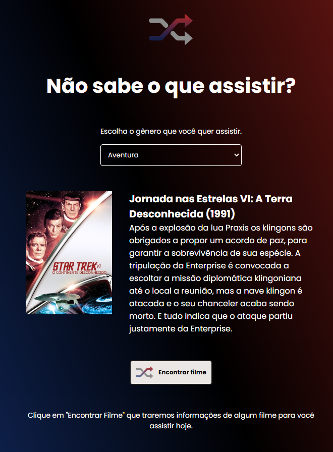

<h1 align="center"> Rocketflix </h1>

Este é um dos desafios disponíveis na plataforma Rocketseat, feito para exercício de conhecimentos em HTML, CSS e Javascript. 😁  

<strong><a href="https://marcosassilva.github.io/rocketflix/">Acesse o projeto aqui!</a></strong>
  

  <a href="#-tecnologias">Tecnologias</a>&nbsp;&nbsp;&nbsp;|&nbsp;&nbsp;&nbsp;
  <a href="#-projeto">Projeto</a>&nbsp;&nbsp;&nbsp;|&nbsp;&nbsp;&nbsp;
  <a href="#-layout">Layout</a>&nbsp;&nbsp;&nbsp;|&nbsp;&nbsp;&nbsp;
  <a href="#memo-licença">Licença</a>

 

  

## 🚀 Tecnologias

Esse projeto foi desenvolvido com as seguintes tecnologias:

- HTML e CSS
- JavaScript
- Fetch API
- Git e Github
- Figma

## 💻 Projeto

Trata-se de uma página que consome a API da [The Movie Database](https://www.themoviedb.org/) retornando nome, poster e sinopse de um filme aleatório.

<strong>Features adicionais:</strong>
- Retornar também ano de lançamento do filme.
- Opção de escolha do gênero desejado.

[Visite o projeto online.](https://marcosassilva.github.io/rocketflix/)

## 🔖 Layout

Você pode visualizar o layout do projeto através [DESSE LINK](https://www.figma.com/file/gsX4Zx27p1DV8jiaBUCnDH/DD-%2F-Rocketflix-(Copy)?node-id=3-2&t=e3R7NJWMNpSGXb6T-0). É necessário ter conta no [Figma](https://figma.com) para acessá-lo.

## 📜 Licença

Esse projeto está sob a licença MIT.
